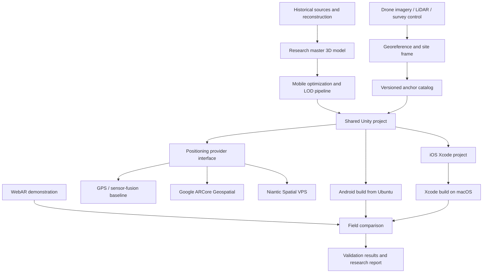

# System architecture

## Logical architecture



## Design principles

### One application, replaceable positioning providers

The scene, interface, assets, logging, and experimental protocol remain shared. Vendor-specific SDK code sits behind `IGeospatialAnchorProvider`. This makes GPS, Google, Niantic, and mock/local placement comparable without rewriting the rest of the application.

### Accuracy is application state

The application must not treat “GPS available” as “model correctly aligned.” Each provider reports:

- tracking state;
- horizontal and vertical accuracy estimates;
- heading accuracy where available;
- localization duration;
- provider and map/site identifiers;
- recoverable failure reason.

The UI gates model visibility using documented thresholds and records when those thresholds are crossed.

### Two model classes

- **Research master:** highest defensible detail, full provenance, retained outside mobile build size constraints.
- **Mobile derivative:** decimated mesh, mobile textures, level-of-detail variants, colliders/occlusion meshes, and immutable provenance link to the master.

### Coordinate chain

```text
Historical/model coordinates
  → surveyed local site frame
  → East-Up-North orientation
  → WGS84 latitude/longitude/ellipsoidal or terrain-relative altitude
  → provider anchor
  → Unity local coordinates
```

Every transformation must be documented. Terrain height, orthometric height, and WGS84 ellipsoid height must not be silently interchanged.

## Repository boundaries

| Path | Purpose |
|---|---|
| `config/` | Public-safe anchor catalogs and configuration examples |
| `schemas/` | Machine-readable validation rules |
| `unity/` | Unity source that is safe to version |
| `webar/` | WebAR manifests, screenshots, and test notes—not account credentials |
| `iterations/` | Dated plans, logs, evidence indexes, and closeouts |
| `docs/` | Static GitHub Pages site |
| `tools/` and `tests/` | Reproducibility and validation utilities |

Large master models, raw drone imagery, VPS capture video, and signing assets are stored outside Git and referenced through manifests and checksums.
