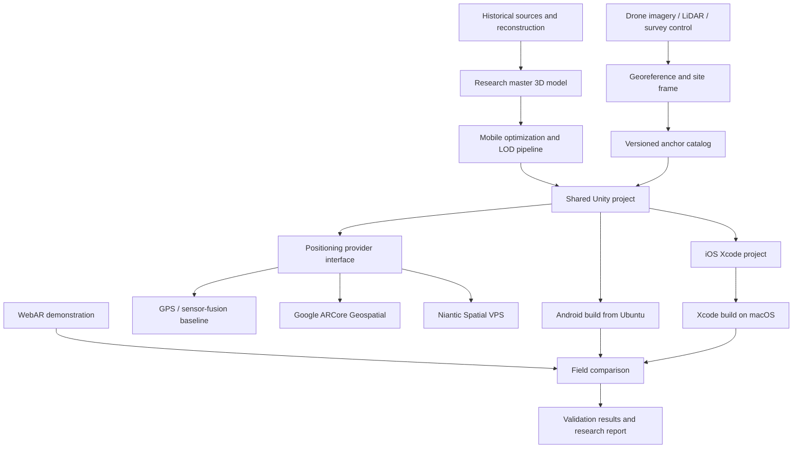

# System architecture

## Logical architecture



## Design principles

### One application, replaceable positioning providers

The scene, interface, assets, logging, and experimental protocol remain shared. Vendor-specific SDK code sits behind `IGeospatialAnchorProvider`. This makes GPS, Google, Niantic, and mock/local placement comparable without rewriting the rest of the application.

### Accuracy is application state

The application must not treat “GPS available” as “model correctly aligned.” Each provider reports:

- tracking state;
- horizontal and vertical accuracy estimates;
- heading accuracy where available;
- localization duration;
- provider and map/site identifiers;
- recoverable failure reason.

The UI gates model visibility using documented thresholds and records when those thresholds are crossed.

### Two model classes

- **Research master:** highest defensible detail, full provenance, retained outside mobile build size constraints.
- **Mobile derivative:** decimated mesh, mobile textures, level-of-detail variants, colliders/occlusion meshes, and immutable provenance link to the master.

### Coordinate chain

```text
Historical/model coordinates
  → surveyed local site frame
  → East-Up-North orientation
  → WGS84 latitude/longitude/ellipsoidal or terrain-relative altitude
  → provider anchor
  → Unity local coordinates
```

Every transformation must be documented. Terrain height, orthometric height, and WGS84 ellipsoid height must not be silently interchanged.

## Implementation status — October 8, 2026

The shared cross-platform architecture remains the target. The local Mac implementation is `LeadMills_AR_POC` (URP, Unity `6000.3.25f1`, AR Foundation / Apple ARKit XR Plugin **6.3.5**), with 0 Project Validation issues. Personal Team signing and deployment work on the iPhone 14 Pro / **iOS 27.0.1**. The first native AR POC camera permission/live feed was verified October 8 after correcting the startup Scene List and making a fresh export. The active camera uses `Mobile_RPAsset` / `Mobile_Renderer` with AR Background Renderer Feature; XR Origin uses Device tracking and Y offset 0. Horizontal-plane rendering and plane-anchor creation run on the device; earlier trials failed stability relative to a floor landmark. Following earlier registration failures, the user verified mesh/plane alignment and a cube staying in place on October 9 after clockwise 90° common-view registration. The promoted default is portrait-only pending other-orientation validation. A provisional surface-readiness gate checks level, local LiDAR triangle coverage, temporal stability and viewpoint change before revealing a selectable blue plane. Render-time pose/projection/plane-normal diagnostics now also compare XR center-eye rotation; this uses session-local geometry and does not change the geospatial provider contract. Repeat corrected default-build floor-contact/stability checks before site assets. The local project is not yet incorporated into `unity/`; source handoff, Android, provider integration, and field validation remain pending. See [Unity/iOS setup](unity/IOS_SETUP.md).

## Repository boundaries

| Path | Purpose |
|---|---|
| `config/` | Public-safe anchor catalogs and configuration examples |
| `schemas/` | Machine-readable validation rules |
| `unity/` | Unity source that is safe to version |
| `webar/` | WebAR manifests, screenshots, and test notes—not account credentials |
| `iterations/` | Dated plans, logs, evidence indexes, and closeouts |
| `docs/` | Static GitHub Pages site |
| `tools/` and `tests/` | Reproducibility and validation utilities |

Large master models, raw drone imagery, VPS capture video, and signing assets are stored outside Git and referenced through manifests and checksums.

The experimental floor calibration supports one, two or three selected physical landmarks and captures real image correspondences and tracked poses across three views. It fits only a common projection focal multiplier, preserves native mesh/world poses and CW90, and rejects weak geometry or a failed third-view holdout. An accepted correspondence check enables native plane anchoring at A; it does not establish surveyed accuracy. Tracking loss, mode/plane changes or app pause invalidate the session-local calibration. See [calibration procedure](unity/THREE_POINT_CALIBRATION.md).

The capture UI pauses each view for review. A chronological tap history supports Undo across view/fitted/verified transitions; remaining anchors are reconstructed from saved observations. Count changes clear the trial. Fewer landmarks reduce spatial cross-checks, while fit sensitivity/residual and third-view acceptance remain required. Private records include count, Continue and Undo events for replay. The live ARKit camera background retains its provider display transform; virtual projection calibration does not change optical camera zoom.
